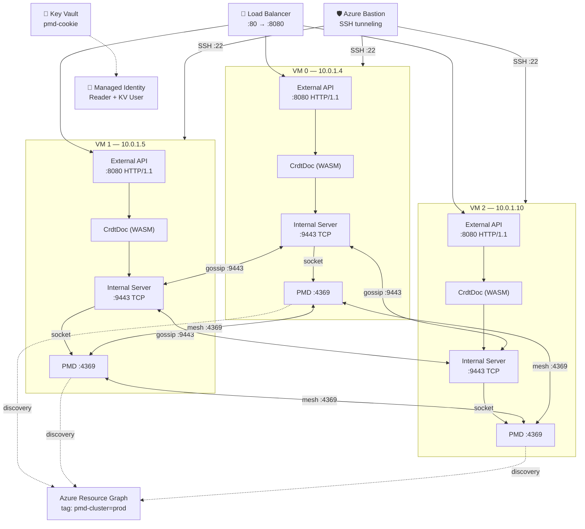
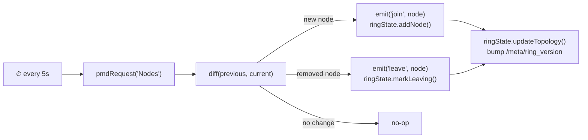
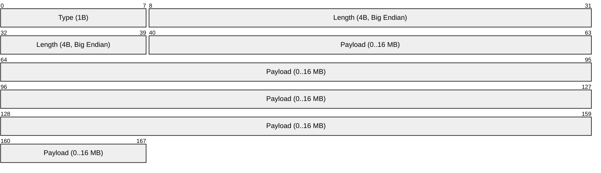
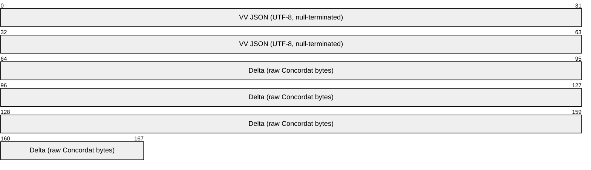
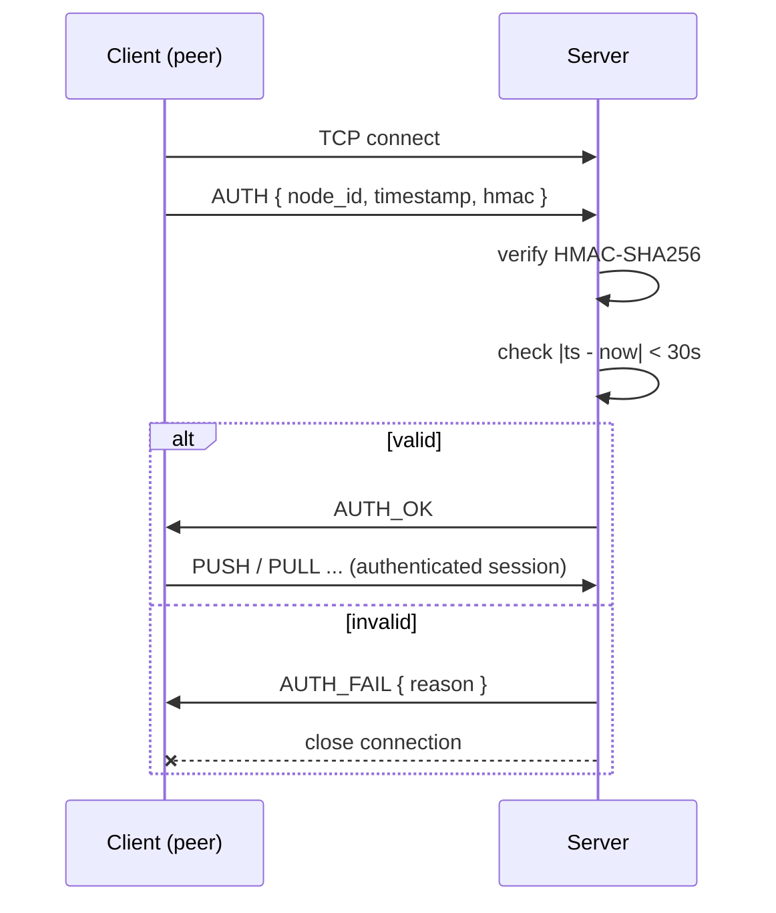
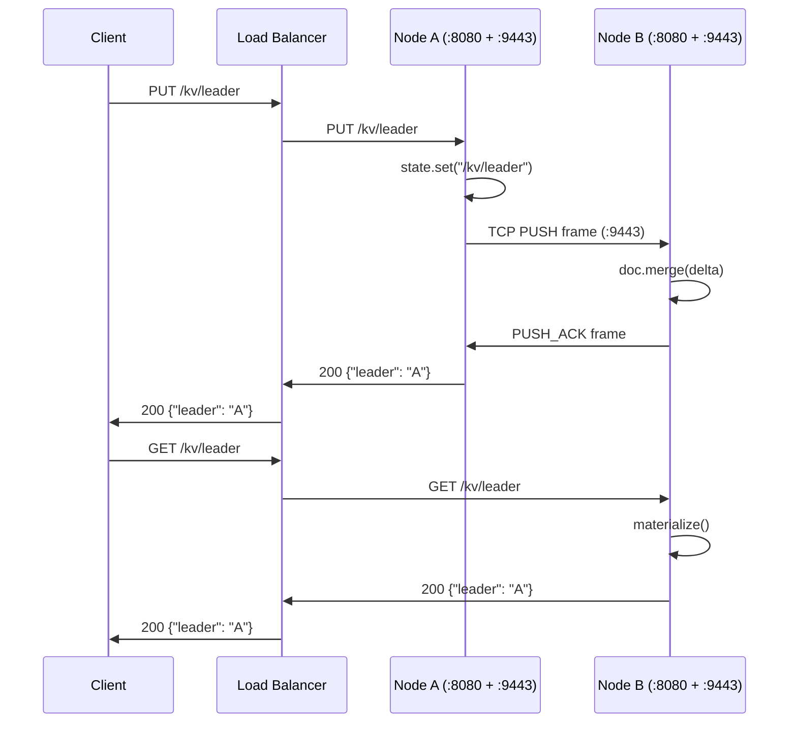

# Project Plan — PMD Cluster on Azure VMSS

## Overview

Distributed [portmapd](https://crates.io/crates/portmapd) mesh cluster running on Azure VMSS (Flexible orchestration), with automatic peer discovery via [portmapd-azure](https://crates.io/crates/portmapd-azure) and a TypeScript API service on each node communicating with PMD via Unix socket.

## Architecture



> **Ports:** `:8080` External = public HTTP/1.1 API (via LB) · `:9443` Internal = node-to-node gossip (subnet only, HMAC-auth) · `:4369` PMD = membership & failure detection · `:22` SSH via Azure Bastion only

## Components

### Infrastructure (`terraform/`)

| File | Purpose |
|------|---------|
| `main.tf` | Provider azurerm ~> 4.0, resource group |
| `variables.tf` | All configurable variables |
| `network.tf` | VNet, subnets, NSG, NAT Gateway, Azure Bastion |
| `identity.tf` | User-assigned managed identity + RBAC |
| `keyvault.tf` | Key Vault + pmd-cookie secret |
| `loadbalancer.tf` | Standard LB, health probe, rule :80→:8080 |
| `vmss.tf` | Flexible VMSS (private IPs only), cloud-init, LB backend pool |
| `outputs.tf` | Resource IDs, LB public IP, Bastion name |

### Application (`app/`)

| File | Purpose |
|------|---------|
| `src/index.ts` | Entry point, lifecycle, SIGTERM |
| `src/app.ts` | External HTTP server (:8080), public routes |
| `src/internal-server.ts` | Internal gossip server (:9443), HMAC-auth middleware |
| `src/pmd-client.ts` | PMD Unix socket client |
| `src/state.ts` | `RingState` — CrdtDoc WASM wrapper, typed accessors |
| `src/ring.ts` | Ring topology — successor/predecessor computation |
| `src/watcher.ts` | `NodeWatcher` — PMD polling, join/leave events |
| `src/gossip.ts` | `GossipManager` — push-pull delta exchange |
| `src/auth.ts` | HMAC-SHA256 auth for internal transport |
| `package.json` | Dependencies (incl. concordat), scripts, version |
| `tsconfig.json` | TypeScript compiler config |

### Configuration

| File | Purpose |
|------|---------|
| `config/config.toml.tpl` | PMD config template (bind=BIND_ADDR placeholder) |
| `scripts/cloud-init.yaml` | Boot: install PMD, Node.js, API, systemd services |

## Phases

### Phase 1 — Infrastructure Foundation ✅

- [x] Terraform project structure (provider, RG, variables)
- [x] Networking (VNet, subnet, NSG port 4369/9090/22/8080)
- [x] NAT Gateway for explicit outbound
- [x] Azure Bastion for SSH access (no public IPs on VMs)
- [x] Key Vault + random cookie secret
- [x] User-assigned managed identity (Reader RG + KV Secrets User)

### Phase 2 — PMD Cluster ✅

- [x] Cloud-init: install Rust, cargo install portmapd
- [x] Cookie retrieval from Key Vault via IMDS
- [x] PMD config with `discovery = ["azure-tag"]`
- [x] Bind on private IP (detected from IMDS)
- [x] systemd service `pmd.service`
- [x] Flexible VMSS (instances visible in Resource Graph)
- [x] Auto-discovery via azure-tag plugin
- [x] 3-node cluster with mesh convergence

### Phase 3 — API Service ✅

- [x] TypeScript API on port 8080
- [x] `GET /` — Hello from <hostname>
- [x] `GET /status` — PMD status + nodes via socket
- [x] Service self-registration via PMD socket (`Register`)
- [x] Graceful shutdown with `Unregister` on SIGTERM
- [x] systemd service `pmd-api.service` (after pmd.service)
- [x] Load Balancer :80 → :8080 with health probe on /status

### Phase 4 — Project Setup ✅

- [x] Git repository initialization
- [x] Custom agents (infra, application, documentalist)
- [x] Project plan (`PLAN.md`)
- [x] Semantic versioning
- [x] Publish to GitHub

### Phase 5 — Testing (next)

- [ ] Install PMD locally (`cargo install portmapd`)
- [ ] Unit tests for PMD socket client (mock socket server)
- [ ] Unit tests for HTTP routes
- [ ] Integration tests against local PMD instance
- [ ] CI pipeline (GitHub Actions)

### Phase 6 — Distributed State with Concordat WASM ✅

Integrate `concordat` (v0.2.0) WASM module to give each node a local CRDT replica that converges automatically across the ring.

#### 6.1 — State Storage Structure

Each node holds a single `CrdtDoc` whose materialized JSON follows this schema:

```jsonc
{
  "ring": {
    // Keyed by node_id — each node writes its own entry
    "<node_id>": {
      "addr": "10.0.1.4",         // private IP
      "port": 8080,               // API port
      "joined_at": 1718000000,    // epoch seconds
      "status": "active",         // "active" | "leaving" | "dead"
      "version": "0.3.0",         // app version
      "successor": "<node_id>",   // next node in ring (by sorted node_id)
      "predecessor": "<node_id>"  // previous node in ring
    }
  },
  "meta": {
    // Cluster-wide metadata (any node can write)
    "cluster_name": "pmd-cluster-prod",
    "ring_version": 42            // monotonic counter, bumped on topology change
  },
  "kv": {
    // Application-level shared key-value store (CRDT-merged)
    // Users of the API can read/write arbitrary keys here
  }
}
```

**Files to create:**

| File | Purpose |
|------|---------|
| `app/src/state.ts` | `RingState` class — wraps `CrdtDoc` WASM, exposes typed accessors |
| `app/src/ring.ts` | Ring topology logic — compute successor/predecessor from sorted node list |

**Key design decisions:**

- One `CrdtDoc` per node, replica ID = PMD `node_id`.
- `/ring/<node_id>` entries are written **only** by the owning node (avoids concurrent writes on the same path).
- `/kv/*` is a free-form shared namespace where concurrent writes are resolved by Concordat's MV-Register semantics.
- Deltas are opaque `Uint8Array` — the gossip layer ships them as-is.
- `materialize()` is called on-demand for API responses, not cached.

**Installation:**

```bash
# In the app/ directory
npm install concordat    # pre-built WASM from npm (wasm-pack --target nodejs)
```

- [x] Design state schema (this section)
- [x] Add `concordat` WASM dependency to `package.json`
- [x] Implement `RingState` class (`app/src/state.ts`)
- [x] Implement ring topology helpers (`app/src/ring.ts`)
- [x] Unit tests for state mutations and ring ordering

---

### Phase 7 — Node Discovery via PMD Polling

Use the local PMD socket to discover nodes joining/leaving the cluster. The API already queries `Nodes` on-demand; this phase adds a **periodic poller** that feeds topology changes into the `RingState`.

#### 7.1 — Discovery Loop



**File:** `app/src/watcher.ts`

```typescript
// Simplified interface
export class NodeWatcher extends EventEmitter {
  constructor(pmd: PmdClientOptions, state: RingState, intervalMs?: number);
  start(): void;
  stop(): void;
  // Events: "join" (PmdNode), "leave" (PmdNode), "error" (Error)
}
```

**Behavior:**

1. Polls `Nodes` via Unix socket every `WATCH_INTERVAL` (default 5 s, configurable via `WATCH_INTERVAL_MS` env var).
2. Compares returned `node_id` set with previously known set.
3. On **join**: emits `"join"` event, calls `ringState.addNode(node)` which writes to `/ring/<node_id>` and recomputes successor/predecessor.
4. On **leave**: emits `"leave"` event, calls `ringState.markLeaving(node_id)` which sets `status: "leaving"`, then after a grace period `ringState.removeNode(node_id)`.
5. On every change: bumps `/meta/ring_version` and produces a delta for immediate gossip push.

- [ ] Implement `NodeWatcher` class (`app/src/watcher.ts`)
- [ ] Wire watcher into `index.ts` lifecycle (start after server listen, stop on SIGTERM)
- [ ] Unit tests with mock socket returning varying node lists

---

### Phase 8 — Internal Gossip Transport

A dedicated internal server for node-to-node gossip, **separate from the public API**. Listens on port `:9443`, restricted to the VNet subnet via NSG, and authenticated with HMAC-SHA256 using the PMD cookie (already distributed via Key Vault).

#### 8.0 — Transport Options Analysis

Three options were evaluated, all using **Node.js stdlib only** (no external dependencies):

| | **Option A — Raw TCP** | **Option B — HTTP/2** | **Option C — HTTP/1.1** |
|---|---|---|---|
| **Module** | `node:net` | `node:http2` | `node:http` |
| **Framing** | Custom: 1-byte type + 4-byte length + payload | Native HTTP/2 frames | Chunked transfer / Content-Length |
| **Multiplexing** | Manual (single stream per connection) | Native (multiple streams per connection) | One request per connection (or keep-alive) |
| **Binary support** | Native — `Uint8Array` shipped directly | Native — binary DATA frames, no encoding | Requires base64 encoding in JSON |
| **Connection reuse** | Persistent TCP, reconnect on failure | Built-in with `session` + auto-ping | Keep-alive (fragile, timeouts) |
| **Overhead per msg** | ~5 bytes (type + length header) | ~9 bytes (HTTP/2 frame header) | ~200+ bytes (HTTP headers) |
| **Debugging** | Opaque binary, needs custom tooling | Semi-opaque, but browsers/curl support h2c | curl, easy to inspect |
| **TLS** | Manual TLS wrapping (`node:tls`) | Built-in ALPN negociation | Manual |
| **Auth** | Custom header in handshake | Standard headers per request | Standard headers per request |
| **Complexity** | High — own framing, reconnect, backpressure | Medium — stdlib handles framing/flow control | Low — familiar HTTP semantics |
| **Latency** | Lowest (~0.1ms framing) | Low (~0.3ms framing) | Higher (~1ms+ header parsing) |

#### 8.0.1 — Decision: **Option A — Raw TCP with length-prefixed binary**

**Rationale:**

1. **Performance** — Deltas are opaque `Uint8Array`. Raw TCP ships them directly without base64 encoding (saves ~33% bandwidth) or HTTP overhead. For a gossip protocol that fires every few seconds per peer, minimal framing matters.
2. **Lightness** — 5-byte header (1 type + 4 length) vs. 200+ bytes of HTTP headers per message. On a 3–10 node cluster doing push-pull every 10s, this is the difference between ~150 bytes/msg and ~1 KB/msg.
3. **Connection reuse** — Long-lived TCP connections between peers. No connection setup per gossip round. Reconnect logic is simple (the watcher already knows when nodes join/leave).
4. **Stdlib only** — `node:net` + `node:crypto` (for HMAC). No external dependencies.
5. **Natural fit** — Gossip is a peer-to-peer binary protocol, not a request/response API. TCP streams model this more faithfully than HTTP.

**Trade-offs accepted:**
- Custom framing code (~50 lines for encode/decode)
- Binary debugging requires a small CLI tool or log-level hex dump
- Must handle reconnection and backpressure ourselves

#### 8.1 — Wire Protocol



| Type | Code | Payload | Direction |
|------|------|---------|-----------|
| `AUTH` | `0x01` | `{ node_id, timestamp, hmac }` (JSON) | client → server |
| `AUTH_OK` | `0x02` | empty | server → client |
| `AUTH_FAIL` | `0x03` | `{ reason }` (JSON) | server → client |
| `PUSH` | `0x10` | VV + delta bytes | bidirectional |
| `PUSH_ACK` | `0x11` | VV + optional delta bytes | response |
| `PULL` | `0x20` | VV (JSON) | client → server |
| `PULL_RESP` | `0x21` | VV + delta bytes | response |
| `PING` | `0x30` | empty | bidirectional |
| `PONG` | `0x31` | empty | bidirectional |

**Payload encoding for PUSH/PULL messages:**



The version vector is a short JSON object (`{"replica-1":5,"replica-2":3}`), null-terminated. Everything after the null byte is the raw Concordat delta (`Uint8Array`), shipped without any encoding.

#### 8.2 — Authentication



- **Shared secret**: PMD cookie from Key Vault (already on every node)
- **HMAC**: `HMAC-SHA256(cookie, node_id + ":" + timestamp)`
- **Replay protection**: server rejects if `|timestamp - server_time| > 30s`
- **One auth per connection**: long-lived connections don't re-auth per message

**File:** `app/src/auth.ts`

```typescript
import { createHmac, timingSafeEqual } from "node:crypto";

export function signAuth(cookie: string, nodeId: string, ts: number): string;
export function verifyAuth(cookie: string, nodeId: string, ts: number, hmac: string): boolean;
```

#### 8.3 — Connection Management

```typescript
// app/src/internal-server.ts
export class InternalServer {
  constructor(port: number, bindAddr: string, cookie: string, state: RingState);
  start(): Promise<void>;
  stop(): Promise<void>;
  // Handles incoming connections, auth, and frame dispatch
}

// app/src/gossip.ts  
export class GossipManager {
  constructor(state: RingState, selfNodeId: string, cookie: string);

  // Outbound: maintain persistent connections to peers
  connectToPeer(addr: string, port: number): void;
  disconnectPeer(nodeId: string): void;

  // Lifecycle
  start(peers: () => PeerInfo[]): void;
  stop(): void;

  // Triggered on local mutation → push to fan-out peers
  onLocalMutation(): void;
}
```

**Connection pool:**
- Each node maintains a persistent TCP connection to every known peer
- On `join` event from `NodeWatcher` → open connection + AUTH handshake
- On `leave` event → close connection
- Auto-reconnect with exponential backoff (1s, 2s, 4s, max 30s)
- PING/PONG keepalive every 30s to detect dead connections

#### 8.4 — Gossip Strategy

| Parameter | Value | Rationale |
|-----------|-------|-----------|
| **Mode** | Push-pull | Push on local mutation, periodic pull for anti-entropy |
| **Fan-out** | 2 peers | Each round, pick 2 random peers from ring (sufficient for small clusters) |
| **Pull interval** | 10 s | Background anti-entropy sweep |
| **Push trigger** | On topology change or `/kv` write | Immediate consistency for important events |
| **Transport** | Raw TCP (:9443), length-prefixed binary | Dedicated internal port, no HTTP overhead |
| **Delta encoding** | Raw `Uint8Array` | No base64, shipped as-is over TCP |
| **Deduplication** | Version vector comparison | `deltaSince(remoteVV)` returns only missing ops |
| **Auth** | HMAC-SHA256 (PMD cookie) | One handshake per connection |

- [ ] Implement frame codec (encode/decode length-prefixed messages)
- [ ] Implement AUTH handshake (`app/src/auth.ts`)
- [ ] Implement `InternalServer` (`app/src/internal-server.ts`)
- [ ] Implement `GossipManager` with connection pool (`app/src/gossip.ts`)
- [ ] Implement push logic (serialize delta, send PUSH frame to peers)
- [ ] Implement pull logic (periodic, pick random peers, send PULL frame)
- [ ] Implement merge-on-receive (deserialize, `doc.merge()`)
- [ ] PING/PONG keepalive
- [ ] Unit tests with 3 in-memory replicas
- [ ] Add NSG rule for port 9443 (subnet-only) in `network.tf`

---

### Phase 9 — External & Internal APIs

Two separate servers with distinct concerns:

| | **External API** | **Internal Server** |
|---|---|---|
| **Port** | `:8080` | `:9443` |
| **Module** | `node:http` | `node:net` |
| **Protocol** | HTTP/1.1 JSON | TCP length-prefixed binary |
| **Auth** | None (public) | HMAC-SHA256 (PMD cookie) |
| **Exposed to** | Load Balancer + Internet | Subnet only (NSG restricted) |
| **File** | `app/src/app.ts` | `app/src/internal-server.ts` |

#### 9.1 — External API (`:8080` — public)

HTTP/1.1 JSON API exposed via the Load Balancer. Read-heavy, serves cluster state to external consumers.

| Method | Path | Response | Purpose |
|--------|------|----------|---------|
| `GET` | `/` | `Hello from <hostname>` | Health/identity |
| `GET` | `/status` | PMD status + nodes | PMD cluster status |
| `GET` | `/ring` | Full ring topology (`ring` + `meta`) | Inspect ring membership |
| `GET` | `/ring/:nodeId` | Single node entry | Inspect specific node |
| `GET` | `/kv` | Full `/kv` namespace | List all shared keys |
| `GET` | `/kv/:key` | Value at `/kv/<key>` | Read shared state |
| `PUT` | `/kv/:key` | Sets value, returns new value | Write shared state (triggers gossip push) |
| `DELETE` | `/kv/:key` | Removes key | Remove shared state key |

#### 9.2 — Internal Server (`:9443` — subnet only)

Raw TCP server handling gossip frames. Not an HTTP API — uses the binary frame protocol from Phase 8.

| Frame | Direction | Purpose |
|-------|-----------|---------|
| `AUTH` | client → server | Authenticate peer with HMAC |
| `PUSH` | bidirectional | Send delta to peer |
| `PUSH_ACK` | response | Acknowledge + optional return delta |
| `PULL` | client → server | Request missing deltas |
| `PULL_RESP` | response | Return delta since requester's VV |
| `PING/PONG` | bidirectional | Keepalive |

#### 9.3 — Lifecycle (`index.ts`)

```typescript
// 1. Start internal gossip server (:9443)
const internalServer = new InternalServer(9443, BIND_ADDR, cookie, ringState);
await internalServer.start();

// 2. Start external HTTP API (:8080)
const server = await startApp({ port: 8080, host: HOST, ... });

// 3. Start node watcher (PMD polling → ring updates → gossip push)
const watcher = new NodeWatcher(pmd, ringState);
watcher.on("join", (node) => gossip.connectToPeer(node.addr, 9443));
watcher.on("leave", (node) => gossip.disconnectPeer(node.node_id));
watcher.start();

// 4. Start gossip (periodic pull rounds)
const gossip = new GossipManager(ringState, selfNodeId, cookie);
gossip.start(() => watcher.currentPeers());

// SIGTERM: stop in reverse order
process.on("SIGTERM", async () => {
  gossip.stop();
  watcher.stop();
  await stopApp(server, pmd);
  await internalServer.stop();
});
```

#### 9.4 — Request Flow Example



#### 9.5 — NSG Updates

```hcl
# New rule in network.tf
security_rule {
  name                       = "AllowGossip"
  priority                   = 105
  direction                  = "Inbound"
  access                     = "Allow"
  protocol                   = "Tcp"
  source_port_range          = "*"
  destination_port_range     = "9443"
  source_address_prefix      = "10.0.1.0/24"    # subnet only
  destination_address_prefix = "10.0.1.0/24"
}
```

- [ ] Refactor `app.ts` to only serve external routes
- [ ] Implement `InternalServer` (`app/src/internal-server.ts`)
- [ ] Add `/ring` and `/kv` routes to external API
- [ ] Wire both servers into `index.ts` lifecycle
- [ ] Add NSG rule for port 9443
- [ ] Integration tests: 2-node gossip convergence over TCP
- [ ] Update cloud-init to install `concordat` WASM package

---

### Phase 10 — Enhancements (future)

- [ ] Consistent hashing for key ownership (route `/kv` writes to responsible node)
- [ ] Prometheus + Grafana monitoring stack
- [ ] Alerting on join/leave events
- [ ] Custom VM image (Packer) for faster boot
- [ ] Autoscale rules based on metrics
- [ ] Health check endpoint improvements
- [ ] Snapshot persistence (save `CrdtDoc` to disk on shutdown, restore on boot)
- [ ] Merkle tree–based anti-entropy for large state

## Agents

| Agent | Scope | Responsibilities |
|-------|-------|-----------------|
| `infra` | `terraform/`, `scripts/`, `config/` | Terraform code, deployment, validation |
| `application` | `app/` | TypeScript code, tests, PMD socket client |
| `documentalist` | `*.md`, version | Plans, READMEs, changelog, versioning |

## Technology Stack

| Component | Technology |
|-----------|-----------|
| IaC | Terraform (azurerm ~> 4.0) |
| Cloud | Azure (VMSS Flexible, Key Vault, LB, NAT GW) |
| Membership | portmapd v0.5.0 + portmapd-azure |
| CRDT | concordat v0.2.0 (WASM/Node.js) |
| API Runtime | Node.js 20 LTS |
| API Language | TypeScript (strict, ES2022) |
| External API | node:http (HTTP/1.1 JSON, :8080) |
| Internal Transport | node:net (TCP length-prefixed binary, :9443) |
| Auth (internal) | HMAC-SHA256 via node:crypto (PMD cookie) |
| PMD Protocol | Unix socket + JSON-line |
