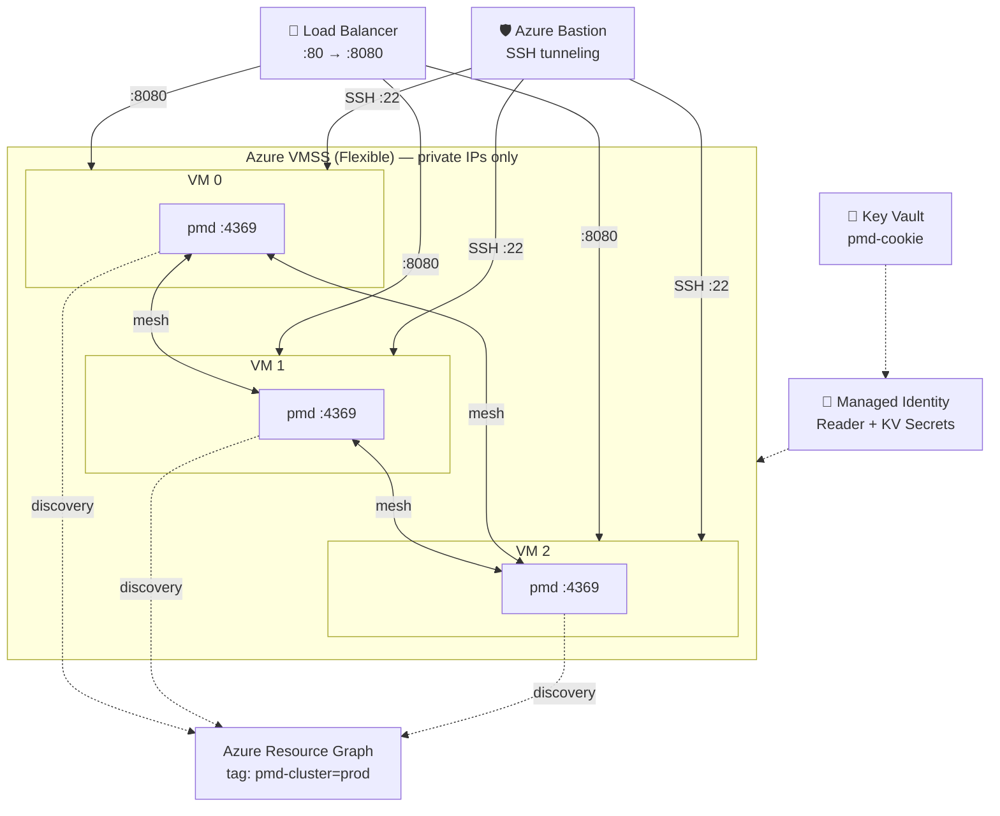

# PMD Cluster on Azure VMSS

Distributed [portmapd](https://crates.io/crates/portmapd) mesh cluster running on an Azure Virtual Machine Scale Set (Flexible), with automatic peer discovery via [portmapd-azure](https://crates.io/crates/portmapd-azure) and a TypeScript API service on each node communicating via Unix socket.

## Architecture



Each VM at boot:
1. Downloads the `pmd` binary from GitHub Releases
2. Retrieves the shared cookie from Azure Key Vault (via managed identity)
3. Starts `pmd` as a systemd service with `discovery = ["azure-tag"]`
4. The azure-tag plugin queries Azure Resource Graph for VMs with tag `pmd-cluster`
5. All discovered peers connect automatically — no manual `pmd join` needed

## Prerequisites

- [Terraform](https://developer.hashicorp.com/terraform/install) >= 1.5
- Azure CLI authenticated (`az login`)
- An SSH key pair (`~/.ssh/id_rsa.pub`)

## Quick Start

```bash
cd terraform

# Copy and edit variables
cp terraform.tfvars.example terraform.tfvars
# Edit terraform.tfvars if needed (region, VM size, etc.)

# Deploy
terraform init
terraform plan
terraform apply
```

## Verify the Cluster

```bash
# Get VMSS instance private IPs
az vmss nic list \
  -g rg-pmd-cluster \
  --vmss-name vmss-pmd-cluster \
  --query '[].ipConfigurations[0].privateIPAddress' -o tsv

# SSH via Azure Bastion tunnel (native client)
az network bastion ssh \
  -n bastion-pmd-cluster \
  -g rg-pmd-cluster \
  --target-resource-id <VM_RESOURCE_ID> \
  --auth-type ssh-key \
  --username azureuser \
  --ssh-key ~/.ssh/id_rsa

# On the VM — check PMD status
systemctl status pmd
pmd status
pmd nodes    # Should list all 3 nodes
```

## Scaling

```bash
# Scale up to 5 instances
az vmss scale -g rg-pmd-cluster -n vmss-pmd-cluster --new-capacity 5

# New VMs will auto-join the cluster within ~30s (azure-tag polling interval)
# Verify from any existing node via Bastion:
az network bastion ssh \
  -n bastion-pmd-cluster -g rg-pmd-cluster \
  --target-resource-id <VM_RESOURCE_ID> \
  --auth-type ssh-key --username azureuser --ssh-key ~/.ssh/id_rsa \
  -- -t "pmd nodes"
```

## Configuration

### PMD Config (`config/config.toml.tpl`)

| Parameter | Default | Description |
|-----------|---------|-------------|
| `port` | 4369 | TCP port for inter-PMD communication |
| `discovery` | `["azure-tag"]` | Discovery plugin (azure tag-based) |
| `heartbeat_interval_secs` | 2 | Heartbeat frequency |
| `sync_interval_secs` | 5 | CRDT delta sync frequency |
| `phi_threshold` | 8.0 | Phi accrual failure detector threshold |
| `metrics_port` | 9090 | Prometheus metrics endpoint |

### Terraform Variables

| Variable | Default | Description |
|----------|---------|-------------|
| `location` | `westeurope` | Azure region |
| `vm_size` | `Standard_B2s` | VM SKU |
| `vmss_min_instances` | 3 | Initial instance count |
| `pmd_cluster_tag_value` | `prod` | Tag value for discovery |
| `pmd_version` | `v0.5.0` | PMD release version |

## Security

- **Azure Bastion**: SSH access via Bastion tunnel only — no public IPs on VMs
- **Cookie auth**: All nodes share a 32-byte HMAC cookie stored in Key Vault
- **mTLS**: Inter-node TLS with auto-generated certificates
- **Managed Identity**: VMs use user-assigned MI — no credentials stored on disk
- **NSG**: Port 4369 restricted to subnet-internal traffic; SSH restricted to Bastion subnet
- **systemd hardening**: `NoNewPrivileges`, `ProtectSystem=strict`, `PrivateTmp`

## Cleanup

```bash
terraform destroy
```

## Roadmap (future iterations)

- [ ] Service registration on the PMD mesh (application-level services)
- [ ] Shared CRDT state via `concordat` across cluster nodes
- [ ] Prometheus + Grafana monitoring stack
- [ ] Alerting on join/leave events
- [ ] Custom VM image (Packer) for faster boot
